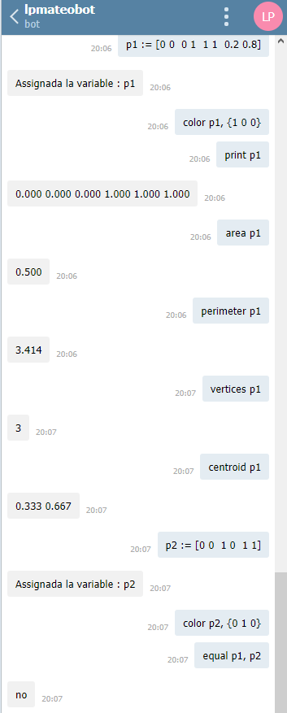
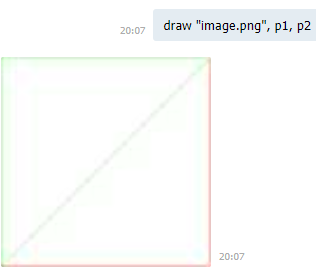

# Telegram Bot

Projecte desenvolupat per l'assignatura **Llenguatges de programació**. Aquest bot permet operar i calcular
operacions amb polígons convexes.

## Getting Started


### Prerequisites

Per instalar els requirements cal executar la següent comanda.
```
pip3 install -r requirements.txt
```


## Exemple of Input and output

### Input


Exemple de l'entrada que es pot enviar al bot


```
p1 := [0 0  0 1  1 1  0.2 0.8]
color p1, {1 0 0}
print p1
area p1
perimeter p1
vertices p1
centroid p1

print "---"

p2 := [0 0  1 0  1 1]
color p2, {0 1 0}
print p2
equal p1, p2
inside p1, p2
inside [0.8 0.2], p2

draw "image.png", p1, p2

print "---"

print p1 + p2                           // convex union
print p1 * p2                           // intersection
print #p2                               // bounding box
equal p1 + p2, #p2                      // complex operations
p3 := #((p1 + p2) * [0 0  1 0  1 1])    // complex operations

r := !100                               // convex polygon made with 100 random points´´´
```

**Nota :** El bot falla per operacions complexes com és el cas de la següent instrucció.

```p3 := #((p1 + p2) * [0 0  1 0  1 1])    ```

### Output

La sortida resultant és:





## Running the tests

S'han realitzat un test que realitza i testeja múltiples casos. 

Per córrer el test de forma automàtica executar la següent comanda en el directori test

```
python3 test.py
```
**Nota** : El càlcul de l'intersecció és efectuat de forma correcta. Disposa d'un petit error i retorna punts repetits.

## Arxius

* **cl :** carpeta que conté l'interpret i compilador
* **bot :** carpeta que conté el bot de telegram
* **test :** carpeta que conté el fitxer de test
* **poligons.py :** codi del programa que efectua els càlculs 

## Built With

* [Python3](https://devdocs.io/python~3.7/) - Interpret utilitzat
* [antlr4](https://github.com/antlr/antlr4/blob/master/doc/index.md) - Parser
* [Pillow](https://pillow.readthedocs.io/en/stable/) - Impressió d'imatges
* [Telegram-bot](https://core.telegram.org/bots/api#sendmessage) - Bot de telegram 


## Autor

**Ramon Mateo Navarro** . Estudiant d'enginyeria informàtica de la Facultat d'informàtica de Barcelona. Menció en enginyeria de computadors.
